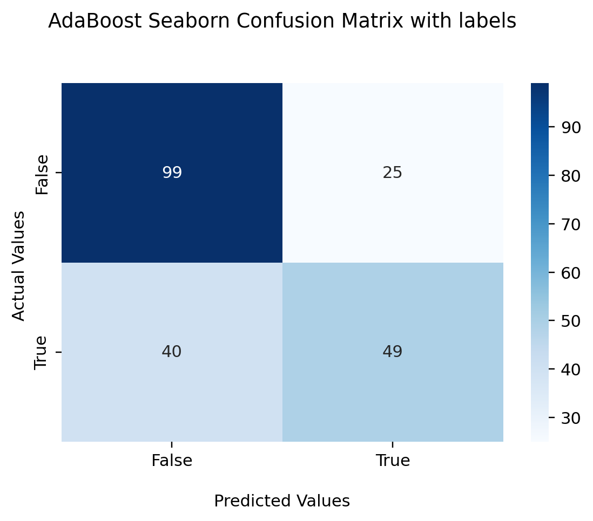

# Machine Learning vs Initial Public Offerings
Authors: Amandeep Kaur, Nitin Thomas, Prabhdyal Singh, Rabih Raymond Antoun, Matthew Phan

# Project Overview
 Machine Learning libraries with ensemble methods(adaboost), gradient boosting(xgboost), decision trees(random forest generator)
 and deep learning neural networks (long term short term memory) , regression models (K-Nearest Neighbour), confusion matrices 
 (multiclassification) shall predict the outcomes of positive or negative returns of new companies.
 
# Data Preperatrion
 Get IPO data manually from up to 2018 from iposcoop.com with internet wayback machine, and then using yahoo finance to merge 
 the SPY index with this using features 10 , 84 days before the IPO, and 100 days after.
 
 For adding additional and extra features, the YF data scraper notebook gets financial statements, balance sheets, and cash flows
 All together 79 features are used for the machine learning models. Nulls were dropped and then fitted.
 ## 

```
parser = pd.io.parsers.ParserBase({'usecols': None})

for df in dfs:
     df.columns = parser._maybe_dedup_names(df.columns)
df = pd.concat(dfs, ignore_index=False)
df = df.set_index(['Ticker','Date'])
```


# Detailed Usage / Installation
  Main file code is inside a Jupyter Notebook with deep learning libraries imported. Seperate dataframes using dates 10 days before,
  84 days before, and 100 days after an offer date is used to merge with a yahoo finance spy index and then having returns calculated.
  *note this can take 25 minutes for processing*
  The downloaded dataframe gets saved to a csv file in order to prevent 25min wait time re-downloading date when restarting kernel
  
  
## Code Snippet for Target (y value) 

```
# Create binary encoded column for whether or not stock saw positive gains after 100 days
returns_bin = []
for pct in filter_ipo['100 day Return']:
    if pct >= 0:
        returns_bin.append(1)
    else:
        returns_bin.append(0)
        
filter_ipo['100D Y/N'] = returns_bin

```

  Encoding of the returns was neccessary for using non negative values in the maching learning libraries.
  

# Application Examples / Summary Analysis
It appears that XG Boost, Ada boost and random forest have the highest accuracy score
and the offer price, market cap, and 1st day close are the top 3 feature importance 


# Screenshots
# Decision Tree


## Heatmaps for models
# Adaboost
 


# XGBoost
 


# Logistic Regression
 

# Random Forest


## Confusion Matrcices for Models
# Adaboost-----|-----Logistic Regression-----|----XG Boost      

# Random Forest

  
